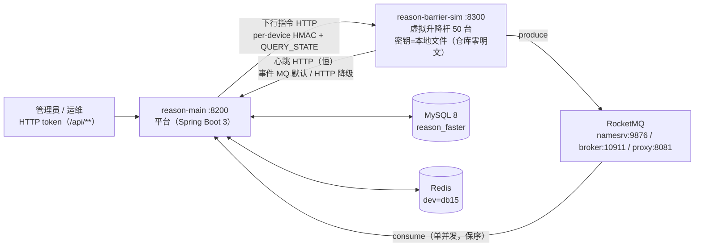
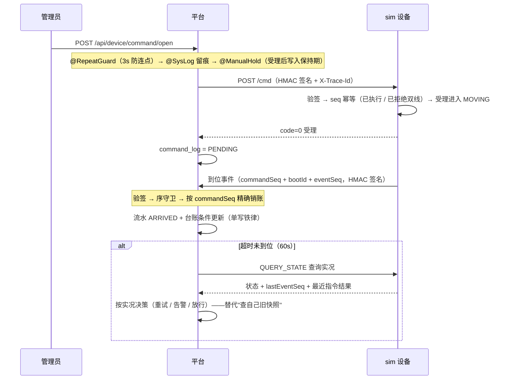
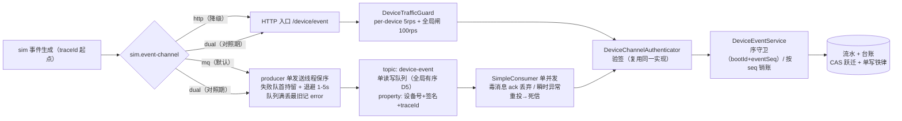
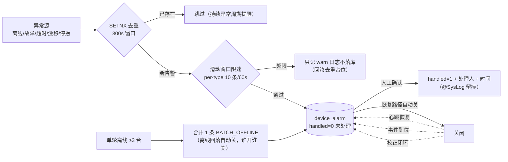
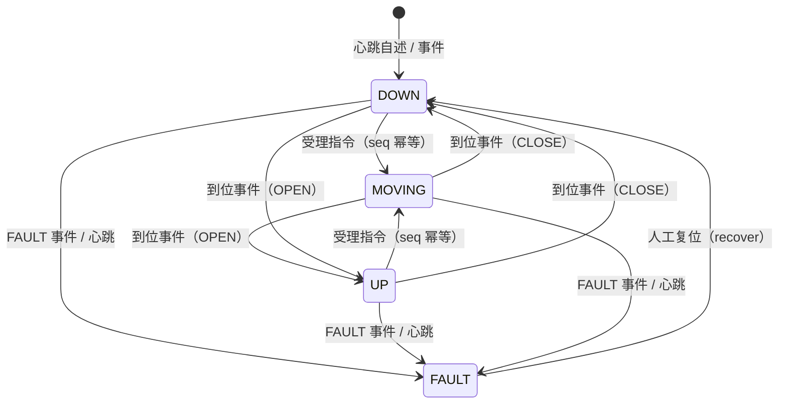
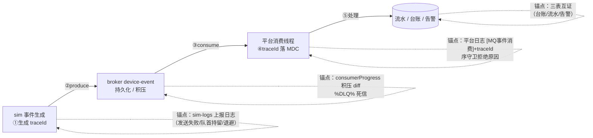

# 升降杆样例 —— 架构图集（可视化总览）

> 用途：把散落在运行手册 / 契约 / block-records 里的结构与流程用图收拢，降低阅读门槛。
> 维护规则：协议 / 拓扑 / 状态机变更时同步更新本图集（图用 mermaid，GitHub 原生渲染）。
> 相关文档：运行手册（怎么跑）、契约 `contracts/PROTOCOL-V2.md`（协议细节）、红队文档（问题与修复史）、`document/block-records/`（各批次结论与证据）。

---

## 1. 系统上下文与进程拓扑

- 云部署形态=单机六进程（MySQL + Redis + MQ 三进程 + main + sim，见部署手册）；本地=双进程 + 本机中间件。
- 通道三态（D-A）：`sim.event-channel=mq（默认）| http | dual`；心跳恒 HTTP（D3：判活不依赖 broker）；下行恒 HTTP。
- 安全边界：管理端=token + RBAC；设备面=per-device HMAC（上行验签 + 下行签名，事件与心跳双通道同权）。

## 2. 手动抬杆指令闭环（时序）

## 3. 事件上行双通道数据流

- 幂等吸收：重复投递由业务层（序守卫 + 按 seq 精确销账）吸收，consumer 不做额外去重。
- 位置：HTTP 入口限流在验签之前；MQ 路径的保护=broker 持久化 + 单并发消费 + sim 保序队列。

## 4. 告警生命周期

- 四类恢复关闭路径：心跳恢复关 OFFLINE / 事件到位关 MOVING_STUCK / 校正闭环关 AUTO_CORRECT_FAILED / 批量离线谁开谁关。
- 任务看护独立通道：job 停摆 → ERROR 日志 + JOB_STALLED（每任务独立去重键）。

## 5. 设备状态机与治理闸

码值：`UP=1 / DOWN=2 / MOVING=3 / FAULT=4`（device_record.device_state）。

治理闸（围绕状态机叠加，不改变状态机本身）：

| 机制 | 作用点 | 一句话语义 |
|---|---|---|
| AutoTask 四道仲裁 | 自动升降下发前 | 保持期让位 → 离线跳过 → MOVING 跳过 → 应然已满足跳过 |
| MonitorTask 重试 | PENDING 超时 | 复用仲裁 + 代际裁决（旧代际 SUPERSEDED）；先 QUERY_STATE 再决策 |
| 熔断 | 连续 N 次校正未闭环 | 停自动 + AUTO_CORRECT_FAILED 告警（平台观测连续失败，非设备自认） |
| MOVING 巡检 | 台账卡 MOVING 超阈值 | 告警转人工（只喊不改状态） |
| 手动保持期 | 手动指令受理后 30min | 自动规则让位（DB 双写，Redis 丢失可重建） |

## 6. 事故三分段定位（MQ 形态）

- 判定手法：同一 traceId 在 sim 日志 / broker 积压 / 消费日志 / DB 落值四处可核对——断在哪一段由"traceId 消失的位置"判定。
- 兜底：任务看护（JOB_STALLED）发现"静默停摆"（数据库说启用、实际没跑）。
- 对应事故模型：sim→broker 断 / broker 故障 / 消费积压（批次4 三分段手法落档）。
